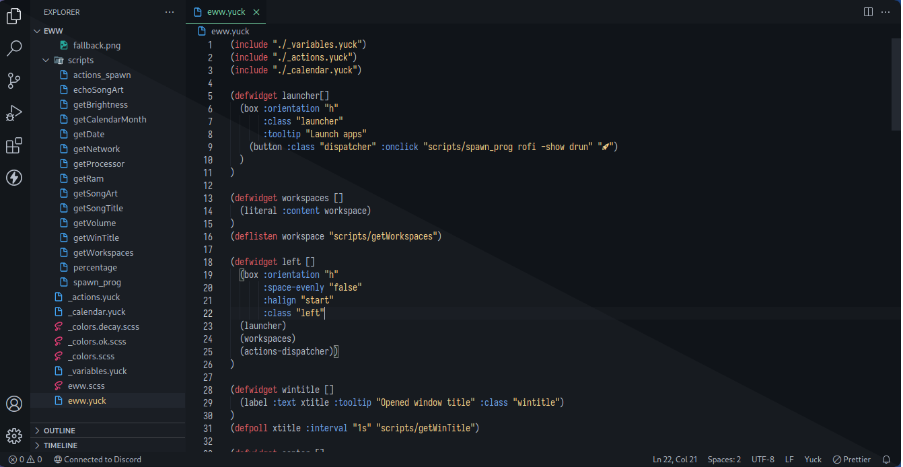

<h1 align="center">Decay For Vscode</h1>

# Decay Theme 
## INFORMATION
Decay uses shades of green along with a dark-toned background for better contrast!

The contrast between background and primary color helps avoiding any eye fatigue when spending a lot of time in front of the computer.

# Setup

### Installing from marketplace

You should know how to do it bruh, just go to the marketplace section, then
search: `Decay` and press the `Install` Button lmao, so simpler.

If you are a pro/haxor user just do this:

1. ctrl + shift + p
2. ctrl + a
3. Backspace
4. Type: `ext install decaycs.decay`
5. Enter

And you will get decay installed like a pro haxor lmfao

### Installing from VSIX

**NOTE**: The cosmic decay variant is in very experimental phase, some highlights could be bad (darker and ugliest highlights lul).

First clone the repo into your prefered directory using:

```sh
git clone https://github.com/decaycs/vscode decay-vscode
```

After that, you will get the vscode port files into a folder named `decay-vscode`

> If you want, you can only download the [vsix](./decay-1.0.9.vsix) file

1. Go and open vscode
2. Open the extensions section
3. Click in the three dots at the top-right of the sidebar
4. Click `Install from VSIX...`
5. Explore and search for the VSIX provided in this repo (it's [this](./decay-1.0.9.vsix))

### Selecting theme

Decay is supporting 4 palettes right now, you can select either:

- Light Decay: Light version :P
- Decay: The original theme :)
- Dark Decay: A darker version of decay :D
- Decayce: A colder version of dark decay :3

### Enjoy

Hope you enjoy with this! and remember to smash the star button if u like this!
